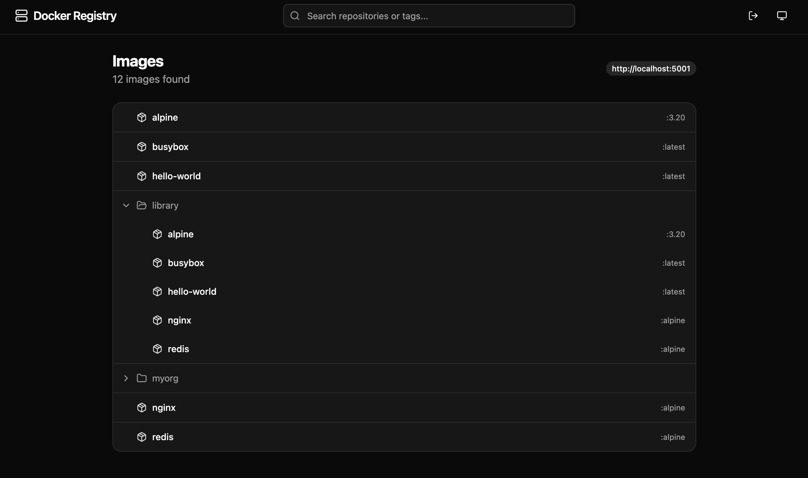
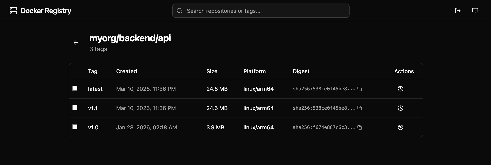
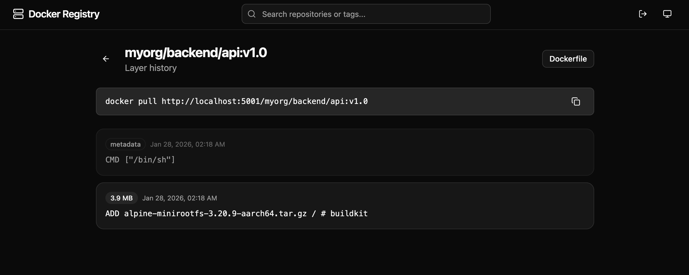

# dockeregistry-ui

A web UI for browsing and managing a Docker registry

## Features

### Images list

Browse all images in the registry with a tree view for namespaced repositories.



### Tags list

View tags with size, platform and digest info, delete tags directly from the UI.



### Layer history

Inspect layer history and view the reconstructed Dockerfile.



## Setup

```bash
cp .env.example .env
pnpm install
```

Edit `.env` to point to your registry:

```
VITE_REGISTRY_URL=http://localhost:5000
```

## Development

```bash
pnpm dev
```

The Vite dev server proxies `/v2` requests to the registry URL, avoiding CORS issues.

### Local registry for testing

```bash
docker compose -f docker-compose.dev.yml up -d
./scripts/seed-registry.sh
```

For a registry with authentication:

```bash
mkdir -p auth
docker run --rm --entrypoint htpasswd httpd:2 -Bbn admin admin > auth/htpasswd
docker compose -f docker-compose.dev.yml up -d
docker login localhost:5001 -u admin -p admin
./scripts/seed-registry.sh localhost:5001
```

Then set `VITE_REGISTRY_URL=http://localhost:5001` in `.env` and use the login button in the UI.
